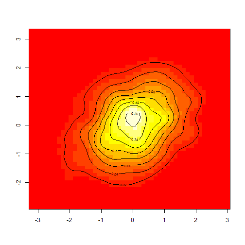

## Introduction (2)

The 2-dimensional normal distribution is often encountered in real-world statistics problems. This shiny application allows a user to visualize the shape and orientation of a 2D normal using a colored contour plot. The user can select the width and orientation of the underlying distribution and then interactively plot it using Shiny.

--- 
## Available Options (3)

* Number of samples: select a value between 100 and 10000
* X standard deviation: enter a value between 1 and 10
* Y standard deviation: enter a value between 1 and 10
* XY correlation: select __None__, __Positive__, or __Negative__.

--- 
## Quick Start (4)

* Using the "Number of samples" slider, select a number of samples
* Enter the X and Y standard deviations
* Select the correlation 

A colored contour plot showing a kernel density estimate of the resulting distribution will be shown.

Below the contour plot, the covariance matrix between X and Y is displayed.

--- 
## More details (5)

Here is an example plot for 1000 samples from a distribution with Sx=1, Sy=1, and Positive correlation:

* Adjusting the X and Y standard deviations will stretch the distribution in the X- or Y- direction respectively.
* The correlation selection changes the XY orientation of the distribution.  As X and Y correlation is increased, the distribution slants postively; if correlation is negative, the distribution will tilt the other direction.
